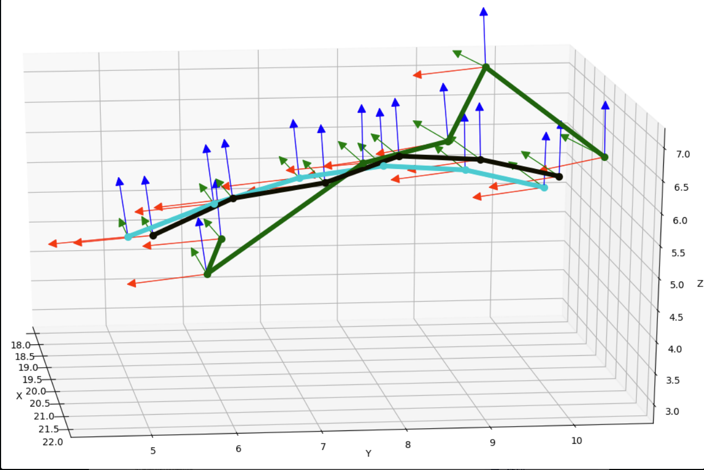
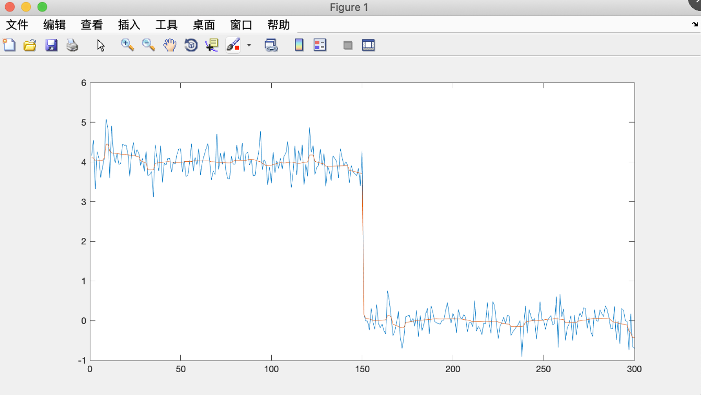
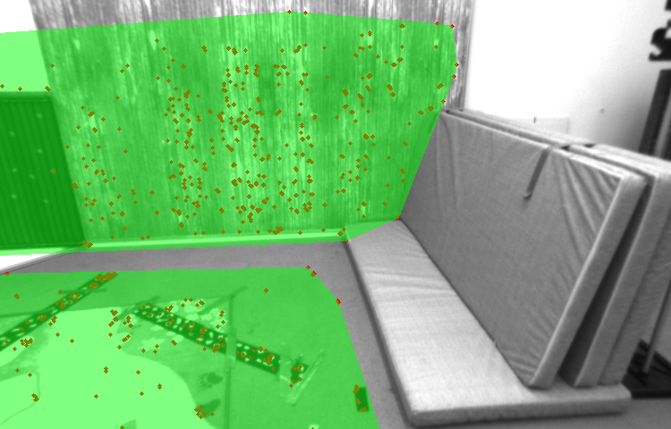
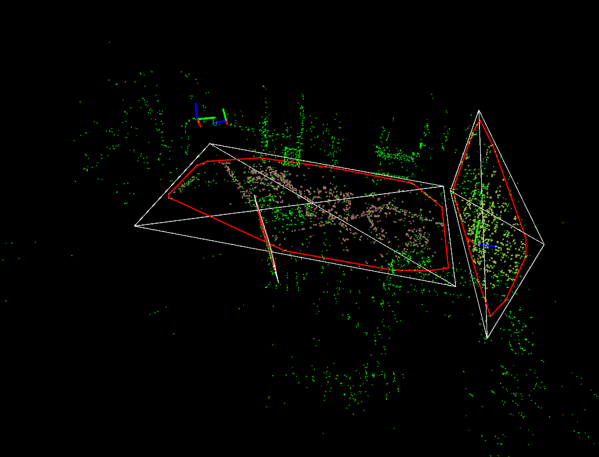

11月主要做了三件事情.

* 在仿真数据集上基于Ceres对Pose和三维点的逆深度进行优化.
* 用一范数优化来做网格的平滑.
* 平面检测与跟踪.

## 在仿真数据集上基于Ceres对Pose和三维点的逆深度进行优化

这部分主要是对line_notes.pdf后半部分的公式进行代码实验,得到了预期的实验结果.上图中表示了在一个时间序列内相机的位姿.其中青色轨迹表示真实值,绿色轨迹表示优化前的初始值, 黑色轨迹表示优化后的值.

结论:公式推导正确,代码实现正确.

## 用一范数优化来做网格的平滑

本月接触了一些凸优化方法并且做了一些代码实验,主要是用凸优化方法来对3维网格进行平滑.在这之前我线用一维信号进行了简单实验,同样的方法也可以用于带噪声信号的平滑,如下图.

其中蓝线是原始信号,红线是平滑后的信号.同样的方法也可以用于3D网格的平滑.

如下是我用自己生成的网格做的实验.

|初始网格|平滑后的网格|
| --------|:----:|
|||

## 平面检测与跟踪

见视频video/find_surface_v101-2019-11-29_20.18.19.mp4

