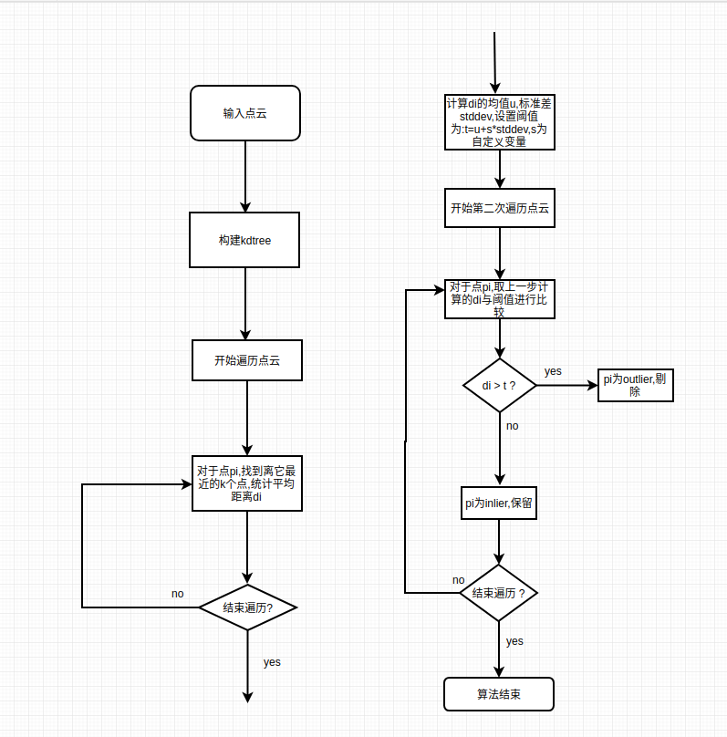

## 三维重建
视频见video文件夹

对不同的极线搜索方法进行了对比实验,见极线搜索对比.pdf

## 点云滤波

|滤波前|滤波后|
| --------|:----:|
|||
|有大量噪点|噪点明显减少|

### 滤波算法

点云滤波算法一般都要依赖kdtree提供点云的邻域信息.kdtree是一种树状结构,当给定一个点时,它可以返回点云中与这个点相邻的点.

* 基于均值和标准差
  
  流程图(点击可放大)

  

* 基于半径
  
  当某个点半径为r的邻域内其他点的个数小于阈值t时,认为该点为outlier否则为inlier.

## 2019-10-11

1. 对点云滤波进行加速, 在不同数据集下测试.
2. 阅读关于线的三维重建,熟悉线在三维空间中的数学表示,几何变换.论文: The 3D Line Motion Matrix and Alignment of Line
Reconstructions

